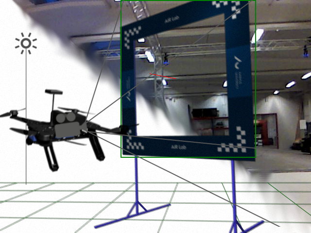

# Exploiting Fast and Accurate Semi-Synthetic Image Generation for Efficient CNN Training

This repository contains the source code for the paper "Exploiting Fast and
Accurate Semi-Synthetic Image Generation for Efficient CNN Training". 




Watch the video:
[](https://youtu.be/T4gJgPNdiH8)

## ROS nodes

The nodes that can be ran onboard are located in the following packages:

- `controllers`: which runs the camera driver, the Vicon bridge and the safety cage
- `img_center_alignment`: which is the state machine and PID controller
- `perception`: which runs the two CNNs (bounding box detection + distance estimation)

To build those, simply place them in your catkin workspace and run `catkin
build` (or `catkin_cmake` if using the legacy build system). The [Catkin
Command Line Tools](https://catkin-tools.readthedocs.io/en/latest/) build
system is recommended.

The three launch files are `controllers control_inteldrone.launch`,
`perception detector.launch`, and `img_center_alignment controller.launch`.
It is required to launch them in that specific order. Note that it is also
recommended to launch the perception node on a stationary computer, since the
inference is quite demanding.

## Environment & Requirements

In order to run the perception node, it is best to use the default
**Python2.7** provided with ROS Kinetic along with a virtualenv environment.

A virtual environment can be created with the given `requirements.txt`
dependency list, as such:

```
virtualenv myenv
source myenv/bin/activate
pip install -r requirements.txt
```

## Dataset creation

Use the **hybrid-dataset-factory** project, which can be found at
[https://github.com/M4gicT0/hybrid-dataset-factory](https://github.com/M4gicT0/hybrid-dataset-factory).
The mesh files used to generate the dataset in this paper can be found in the
**meshes/** folder.

## Gate detection

The complete CNN model and code is provided in the **perception** package.
However, if one desires to study the code in detail, the repository is
available at
[https://github.com/M4gicT0/mobilenet_v2_ssdlite_keras](https://github.com/M4gicT0/mobilenet_v2_ssdlite_keras)
in the `custom_dataset` branch.


## Gate distance estimation

For the distance estimation, only the saved model is given in the
**perception** package. The source code is available at
[https://github.com/M4gicT0/GatePoseEstimator](https://github.com/M4gicT0/GatePoseEstimator).
It is still a work-in-progress but feel free to contribute.
